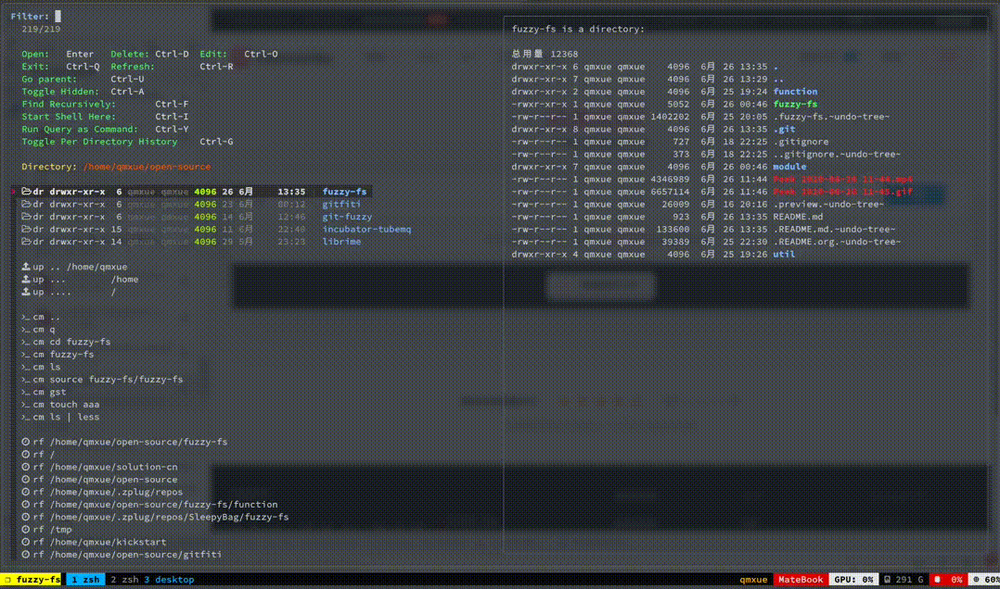
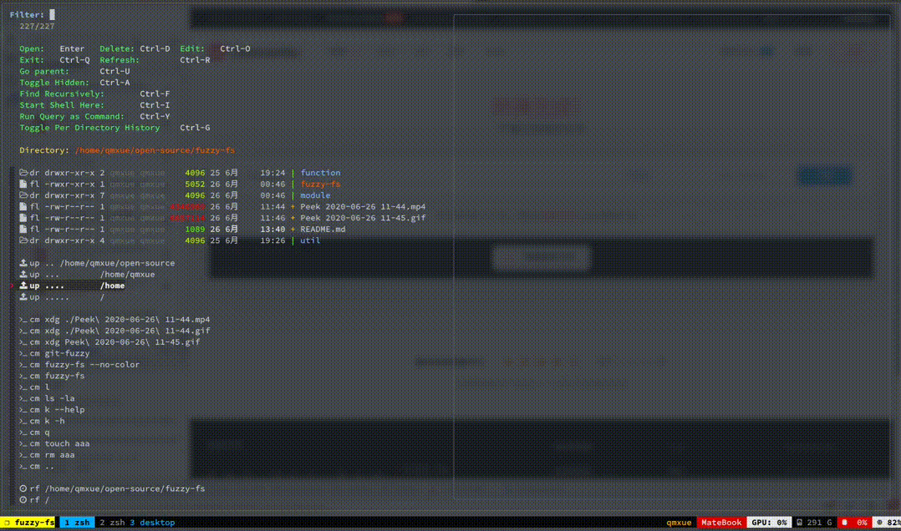
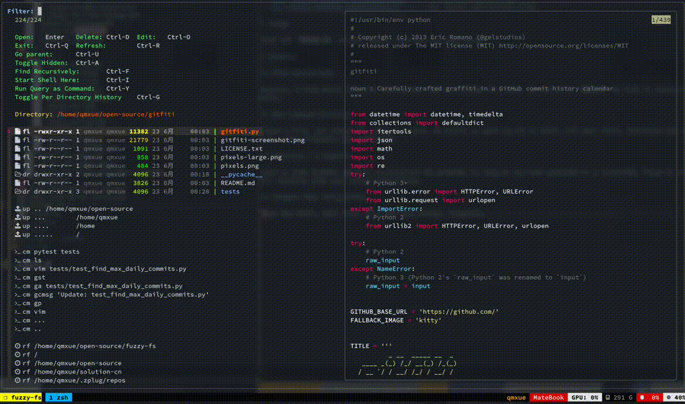

# Fuzzy FS - File Navigator powered by fzf

## Installation

- (Recommanded) Install with [zplug](https://github.com/zplug/zplug "zplug")

```
zplug "SleepyBag/fuzzy-fs", use:fuzzy-fs
```

- Or manually:

1. Clone this repo into an arbitrary path;
2. source file fuzzy-fs in your .zshrc.

## Dependencies

- zsh
- [fzf](https://github.com/junegunn/fzf "fzf")

### Optional

- [z](https://github.com/rupa/z "z") (to list recent files, you don't need autojump if you have z)
- [autojump](https://github.com/wting/autojump "autojump") (to list recent files, you don't need z if you have autojump)
- [k](https://github.com/supercrabtree/k "k") (to show git information in file list)
- [bat](https://github.com/sharkdp/bat "bat") (for colored preview)
- [fd](https://github.com/sharkdp/fd "fd") (for faster and colored find)

# usage

Just run `fuzzy-fs` in your shell, then you are easy to go.


# Feature

## Find Recursively

Usually, you know which file you are looking for, but you can't recall it's path. So let's hit `Ctrl-F` to find it recursively:



## Run Command directly

Touch a file, and remove it, see git status, as easily as what you do in shell. Just hit `Ctrl-Y`, you can run directly what you insert as a command. All your alias, functions and even command history are available. What's more, if you are using [per-directory-history](https://github.com/jimhester/per-directory-history "per-directory-history"), it is also supported.



## Autojump / z support

Used to jump between specific directories? No problem! As long as you have autojump or z installed, fuzzy-fs will natually show your recent directories.


## Elegant tmux integration

Hit `Ctrl-I` to open a new shell, `Ctrl-O` to edit a file. If you are in a tmux session, they will be opened in a new tmux window, elegantly.

If you are not in a tmux session, the new shell will be opened in a new terminal window, which is defined by environment variable `$TERMINAL`, and how editor acts depends on varialbe `$EDITOR`.



# Contributing

As you can see, this is a new project. Anyone is welcomed to report a bug, give an idea, request a feature, or start a merge request. Help me to make it better!
